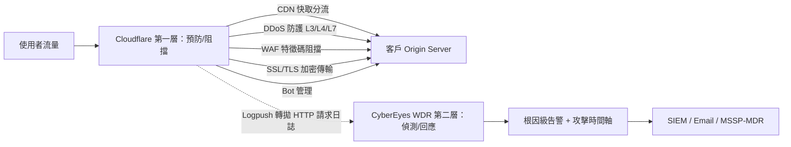

# CDN、WAF、WDR 防護關係層級圖

縱深防護（Defense in Depth）架構：Cloudflare 負責第一層預防與阻擋，CyberEyes WDR 負責第二層偵測與回應，兩者透過 Logpush 串接。

## 第一層：Cloudflare（既有產品）

CDN 快取分流、DDoS 防護（L3/L4/L7）、WAF 特徵碼阻擋、SSL/TLS 加密傳輸、Bot 管理 — 負責「擋下大量已知、自動化的攻擊」。

## 第二層：CyberEyes WDR（新產品）

針對「繞過 WAF」或「偽裝成合法流量」的攻擊做行為分析，補足 Cloudflare 擋不下之後「看不見」的盲點，輸出根因級告警。

## 串接方式

Cloudflare Logpush 直接把 HTTP 請求日誌拋給 CyberEyes，不需要額外硬體或 Agent — 這是本次搭配最大的技術優勢，業務銷售阻力小、實施週期短。

## 視覺化版本

已發布為 Artifact：縱深防護架構圖 — https://claude.ai/code/artifact/25c50cbe-4e8d-4de1-a97c-26a873de01f6
